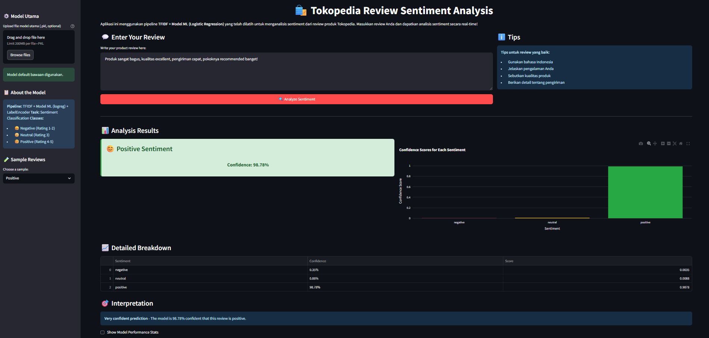

# WARM THE HACK
## Analisis Sentimen Ulasan Produk E-commerce

---



---

### Coba Dashboard Online

Dashboard ini juga tersedia secara online di Streamlit Cloud:
👉 [https://sentimen-ulasan-tokopedia.streamlit.app/](https://sentimen-ulasan-tokopedia.streamlit.app/)

---

### Disusun Oleh:
- Falah Razan Hibrizi
- Siti Nur Khaliza
- Dhifulloh Dhiya Ulhaq

**Data Research:** Central Computer Improvement  
**Institusi:** Telkom University, Bandung  
**Tahun:** 2025

---

## Overview

Proyek ini bertujuan untuk menganalisis sentimen dari ulasan produk pada platform e-commerce Tokopedia menggunakan teknik machine learning ataupun deep learning. Dengan meningkatnya volume ulasan online, analisis sentimen dapat membantu penjual dan pembeli dalam memahami persepsi terhadap produk secara otomatis dan efisien.

Aplikasi dashboard interaktif ini dibangun menggunakan Streamlit, memanfaatkan pipeline **TF-IDF + Logistic Regression + LabelEncoder** untuk klasifikasi sentimen (positif, netral, negatif) berdasarkan teks ulasan. Model dan pipeline dikembangkan dan dievaluasi menggunakan dataset ulasan Tokopedia yang telah dibersihkan dan diproses.

---

## Fitur Dashboard
- **Input Ulasan**: Pengguna dapat memasukkan ulasan produk secara manual atau memilih contoh ulasan.
- **Analisis Sentimen**: Hasil analisis sentimen (positif, netral, negatif) ditampilkan beserta tingkat kepercayaan model.
- **Visualisasi Confidence**: Terdapat grafik confidence score untuk setiap kelas sentimen menggunakan Plotly.
- **Statistik Model**: Opsi untuk menampilkan metrik performa model dan confusion matrix.
- **Upload Model**: Mendukung upload model utama (.pkl) secara custom.
- **Interface yang Responsif**: Dashboard dengan layout wide dan sidebar yang informatif.

---

## Alur Penggunaan Dashboard
1. **Pemilihan Model**
   - Pengguna dapat memilih untuk menggunakan model default (bawaan) yang sudah tersedia di sistem, atau meng-upload model mereka sendiri (file .pkl).
   - Model default menggunakan Logistic Regression yang telah dilatih dengan dataset Tokopedia.
2. **Input Review**
   - Pada kolom "Enter Your Review", pengguna dapat menuliskan review atau komentar mereka terhadap suatu produk.
   - Alternatifnya, pengguna dapat memilih salah satu sample review (positif, netral, atau negatif) yang telah disediakan di sidebar untuk melihat contoh hasil prediksi.
3. **Analisis Sentimen**
   - Setelah review diinput, pengguna cukup menekan tombol **Analyze Sentiment**.
   - Dashboard akan memproses input tersebut menggunakan model yang dipilih, lalu menampilkan hasil prediksi sentimen beserta tingkat kepercayaan (confidence score) dari model.
4. **Visualisasi & Interpretasi**
   - Hasil prediksi ditampilkan secara visual, baik dalam bentuk label sentimen, confidence score, maupun grafik distribusi probabilitas untuk masing-masing kelas sentimen.
   - Terdapat juga interpretasi tingkat keyakinan model terhadap prediksi yang dihasilkan.
5. **Fitur Tambahan**
   - Pengguna dapat melihat statistik performa model (seperti confusion matrix dan evaluation metrics) melalui opsi tambahan di dashboard.

---

## Cara Menjalankan Dashboard
1. **Instalasi dependensi** (direkomendasikan Python 3.9+):
   ```bash
   pip install -r requirements.txt
   ```
2. **Pastikan file berikut tersedia di direktori utama:**
   - `app_product_sentiment.py` (dashboard utama)
   - `logreg_product_sentiment_model/vectorizer.pkl` (TF-IDF vectorizer)
   - `logreg_product_sentiment_model/label_encoder.pkl` (label encoder)
   - `logreg_product_sentiment_model/model.pkl` (model Logistic Regression)
   - `image/model_evaluation.png` (gambar evaluasi model)
   - `image/confusion_matrix.png` (gambar confusion matrix)
3. **Jalankan aplikasi Streamlit:**
   ```bash
   streamlit run app_product_sentiment.py
   ```
4. **Akses dashboard** melalui browser di alamat yang tertera (http://localhost:????).

---

## Metodologi Singkat
- **Data**: Dataset ulasan produk Tokopedia (sekitar 40.000+ data), diambil dari sumber publik.
- **Preprocessing**: Pembersihan teks, pemetaan rating ke label sentimen (1-2: negatif, 3: netral, 4-5: positif).
- **Feature Extraction**: TF-IDF Vectorizer.
- **Model**: Logistic Regression untuk klasifikasi sentimen.
- **Evaluasi**: Akurasi, presisi, recall, F1-score dengan visualisasi confusion matrix.

---

## Struktur File
- `app_product_sentiment.py` : Kode utama dashboard Streamlit
- `logreg_product_sentiment_model/` : Folder model dan pipeline (vectorizer, label encoder, model)
- `Dataset/` : Folder dataset Tokopedia (raw dan cleaned)
- `image/` : Folder gambar evaluasi model
- `Modeling Process Results/` : Folder notebook dan script modeling
- `requirements.txt` : Daftar dependensi

---

## Dependencies
- **streamlit**: Framework untuk web app
- **pandas**: Manipulasi data
- **numpy**: Komputasi numerik
- **scikit-learn**: Machine learning (Logistic Regression, TF-IDF, LabelEncoder)
- **plotly**: Visualisasi interaktif
- **joblib**: Loading/saving model

---

## Credits & Acknowledgement
Proyek ini disusun sebagai bentuk WARM THE HACK untuk persiapan lomba yang akan diadakan oleh tim Central Computer Improvement, Telkom University. Data dan inspirasi model diambil dari berbagai sumber publik dan penelitian terkini di bidang NLP dan analisis sentimen.

---

Untuk detail lebih lanjut, silakan lihat notebook di folder `Modeling Process Results/` atau hubungi tim penyusun.